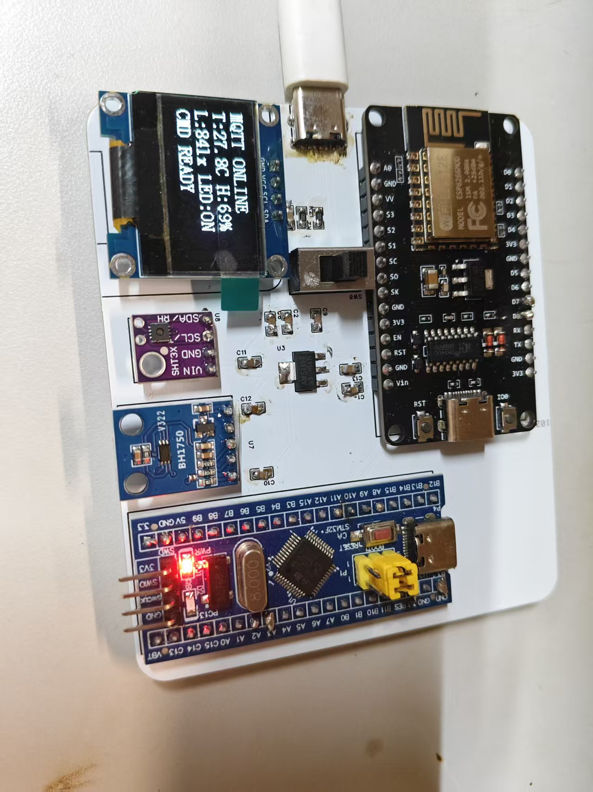
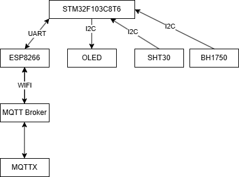
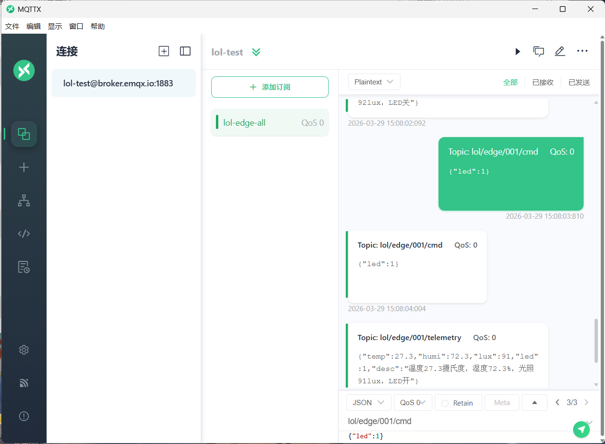
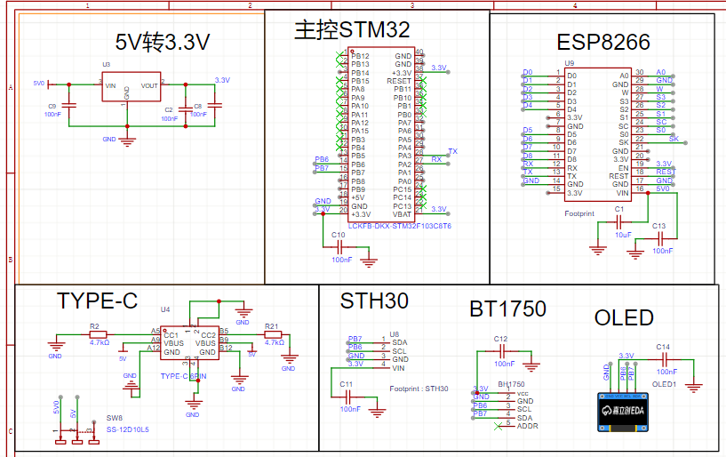

# LOL 边缘节点项目

> STM32F103 + ESP8266 MQTT edge node, with bare-metal / FreeRTOS dual-mode runtime.

设备基于 `STM32F103C8`、`ESP8266`、`Sth30`、`BH1750` 和 OLED 屏幕构建，可通过 Wi-Fi 接入 MQTT Broker，周期上报环境数据，订阅控制主题实现 LED 远程开关，并在本地屏幕显示运行状态。

## 项目亮点

- 双运行模式：支持裸机 `super-loop` 与 `FreeRTOS` 任务调度，通过 [`User/app_config.h`](User/app_config.h) 一键切换
- 分层清晰：串口驱动、ESP8266 AT 封装、MQTT 业务逻辑、应用调度相互解耦
- 可观测性完整：OLED 状态页、`USART1` 调试日志、`ATTEST:AT+...` 透传测试命令

## 功能概览

- 通过 `ESP8266` 连接 Wi-Fi 与 MQTT Broker
- 周期发布温湿度、光照和 LED 状态
- 订阅控制主题并解析 `led=0/1`
- 支持 `USART1` 手动发送 `WIFI:ssid,password` 重新联网
- 支持 `USART1` 发送 `ATTEST:AT+GMR` 等 AT 指令进行链路排查
- OLED 实时显示启动、联网、上报和错误状态
- ESP8266 波特率自恢复，降低初次调试成本

## 硬件组成

- `STM32F103C8`
- `ESP8266`
- I2C OLED
- `Sth30` 温湿度传感器
- `BH1750` 光照传感器
- `PA1` 低电平点亮 LED

## 引脚分配

| 功能 | STM32 引脚 | 说明 |
| --- | --- | --- |
| 调试串口 TX | `PA9` | `USART1_TX`，连接 USB 转串口接收端 |
| 调试串口 RX | `PA10` | `USART1_RX`，连接 USB 转串口发送端 |
| ESP8266 TX | `PA2` | `USART2_TX`，接 `ESP RX` |
| ESP8266 RX | `PA3` | `USART2_RX`，接 `ESP TX` |
| I2C1 SCL | `PB6` | OLED、温湿度、光照传感器共用 |
| I2C1 SDA | `PB7` | OLED、温湿度、光照传感器共用 |
| LED1 | `PA1` | 低电平点亮 |

## 软件架构

核心模块如下：

- [`User/main.c`](User/main.c)：系统入口、外设初始化、模式切换
- [`User/app_tasks.c`](User/app_tasks.c)：裸机模式下的命令处理、链路维护和遥测调度
- [`User/app_freertos.c`](User/app_freertos.c)：FreeRTOS 任务、队列、信号量和互斥量组织
- [`Hardware/MQTT.C`](Hardware/MQTT.C)：Wi-Fi/MQTT 会话、下行消息状态机、上报 JSON 拼装
- [`Hardware/esp8266.c`](Hardware/esp8266.c)：ESP8266 AT 指令封装
- [`Hardware/serial.c`](Hardware/serial.c)：串口驱动，中断 + FIFO 接收

更详细的分层与数据流说明见：

- [`docs/architecture.md`](docs/architecture.md)
- 架构图源文件：[`docs/diagrams/iot-node-architecture.drawio`](docs/diagrams/iot-node-architecture.drawio)

## 项目图片

### 实物图



### 硬件框图



### MQTT 通信示意



### 原理图



## 默认配置

当前默认配置位于 [`User/app_config.h`](User/app_config.h)：

- `APP_FREERTOS_ENABLE = 1U`
- `APP_USART1_ENABLE = 1U`
- `APP_WIFI_AUTO_CONNECT_ENABLE = 0U`
- `APP_WIFI_AUTO_SSID = "YOUR_WIFI_SSID"`
- `APP_WIFI_AUTO_PASSWORD = "YOUR_WIFI_PASSWORD"`
- 默认通过 `USART1` 手动下发联网命令，可修改为自动联网


## MQTT 主题

- 状态主题：`lol/edge/001/status`
- 遥测主题：`lol/edge/001/telemetry`
- 控制主题：`lol/edge/001/cmd`

默认 Broker 配置位于 [`Hardware/MQTTX.H`](Hardware/MQTTX.H)：

- Host：`broker.emqx.io`
- Port：`1883`
- Client ID：`lol-edge-001`

## 快速开始

1. 修改 [`User/app_config.h`](User/app_config.h) 中的运行模式和 Wi-Fi 配置。
2. 如需修改 Broker、Client ID 或主题，更新 [`Hardware/MQTTX.H`](Hardware/MQTTX.H)。
3. 使用 `Keil uVision5` 打开 [`Project.uvprojx`](Project.uvprojx)。
4. 选择 `Target 1`，确认下载器与芯片型号无误后编译烧录。
5. 若保持默认配置，打开 `USART1 @ 115200`，发送：

```text
WIFI:YourSSID,YourPassword
```

6. 需要排查 ESP8266 时，可发送：

```text
ATTEST:AT+GMR
ATTEST:AT+CWMODE?
```

## 串口交互

推荐串口参数：

- 波特率：`115200`
- 数据位：`8`
- 停止位：`1`
- 校验位：`None`

支持的常用命令：

```text
WIFI:MySSID,MyPassword
ATTEST:AT+GMR
ATTEST:AT+CIFSR
```

## 遥测消息示例

```json
{"temp":25.3,"humi":42.1,"lux":123,"led":1}
```

控制消息只要能解析出 `led` 以及其后的 `0/1` 即可，例如：

```json
{"led":1}
```

```text
led=0
```

## 仓库结构

| 目录 | 说明 |
| --- | --- |
| `User/` | 应用层入口、调度与配置 |
| `Hardware/` | 外设驱动、ESP8266 AT 封装、MQTT 业务 |
| `System/` | 延时等基础模块 |
| `Start/` | CMSIS 与启动文件 |
| `Library/` | STM32 标准外设库 |
| `third_party/` | FreeRTOS 内核源码 |
| `docs/` | GitHub 友好的补充文档 |


## 构建环境

- `Keil uVision5`
- `ARMCC 5.06 update 5 (build 528)`
- `Keil.STM32F1xx_DFP 2.3.0`
- 支持 MQTT AT 指令的 `ESP-AT` 固件


## 已知限制

- 当前 MQTT 方案依赖 ESP8266 的 AT 固件能力
- OLED 为简化状态页，主要服务调试与演示
- `LED2_*` 接口仍是预留桩函数
- 主题与 Broker 主要通过宏配置，未做运行时持久化
